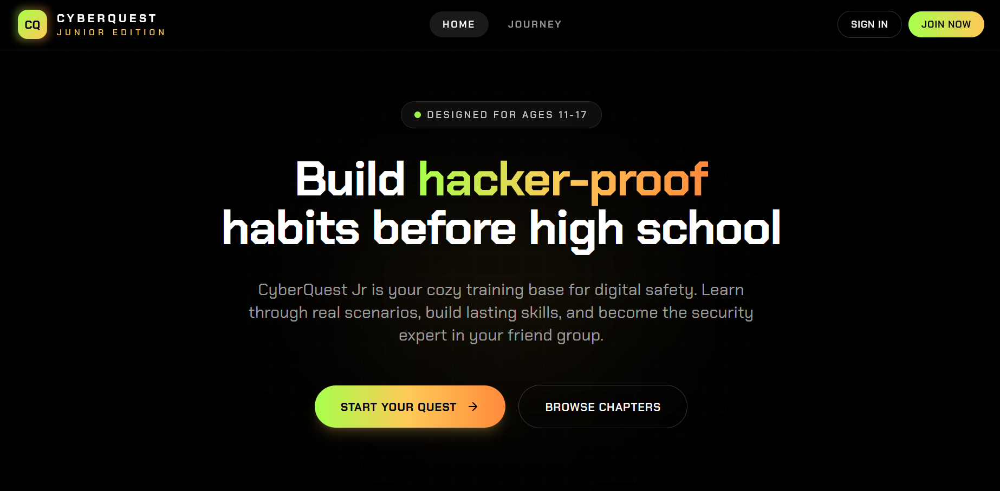
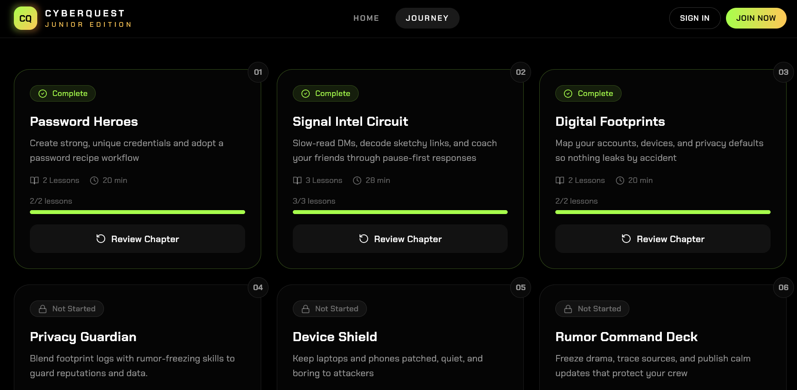
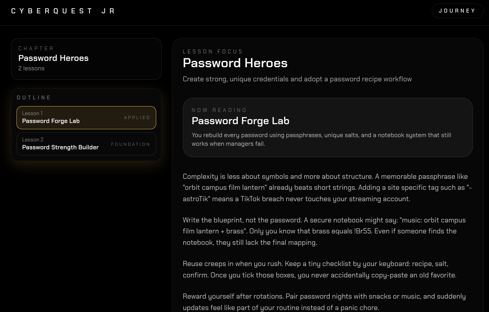
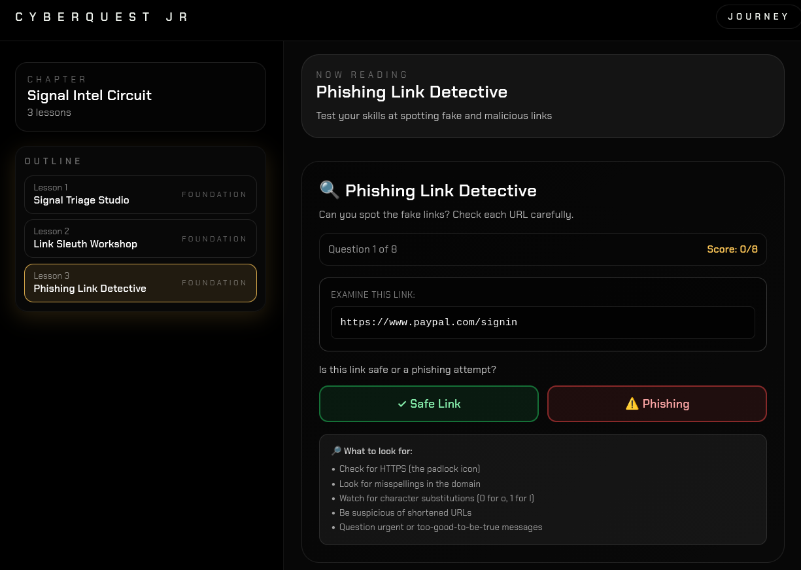

# CyberQuestJR

<div align="center">
  <table>
    <tr>
      <td></td>
      <td></td>
    </tr>
    <tr>
      <td></td>
      <td></td>
    </tr>
  </table>
</div>

CyberQuest Jr is a pure-frontend learning lab that teaches tweens and teens how to stay safe online. The interface leans into AMOLED blacks with glow-edge accents, story-driven lessons, and multiple inline quizzes per lesson. Everything runs locally in the browser—no backend services or API keys required.

## Highlights

- **Story-first lessons** – Each chapter reads like a mini comic with narratives, detective prompts, and reflective coach Q&A blocks.
- **Quiz-heavy practice** – Every lesson ships with 3–4 inline quizzes plus rationale blurbs to reinforce the concept immediately.
- **Pure AMOLED palette** – High-contrast blacks with lime/amber/orange neon edges plus readable fonts (Chakra Petch + Space Grotesk).
- **Keyboard-friendly UI** – Focus rings, descriptive status text, and large tap targets keep everything accessible.
- **Zero backend** – Deploy the static Vite build to any CDN or static host and you’re done.

## Tech stack

- [React 18](https://react.dev/) + [TypeScript](https://www.typescriptlang.org/) via [Vite](https://vitejs.dev/)
- [React Router](https://reactrouter.com/) for lightweight navigation
- [Tailwind CSS](https://tailwindcss.com/) for theming + custom utility layers
- [Lucide](https://lucide.dev/) icons

## Getting started

```bash
git clone https://github.com/Aarav2709/CyberQuestJR.git
cd CyberQuestJR
npm install

# Run the dev server
npm run dev

# Build for production
npm run build

# Preview the production bundle
npm run preview
```

## Project structure

```
CyberQuestJR/
├── src/
│   ├── components/
│   │   ├── InlineQuiz.tsx      # Quiz widget with rationale + focus styles
│   │   ├── Navbar.tsx          # High-contrast top navigation
│   │   └── Sidebar.tsx         # Lesson navigator with outline + difficulty tags
│   ├── data/
│   │   ├── chapters.ts         # Chapter definitions + helper to locate lessons
│   │   └── lessons.ts          # Narrative text, missions, quizzes, coach Q&A
│   ├── hooks/
│   │   └── useChapterProgress.ts # Tiny localStorage helper for chapter status
│   ├── pages/
│   │   ├── LandingPage.tsx     # Hero section + sample questions
│   │   ├── JourneyPage.tsx     # Numbered chapter list with live progress
│   │   └── ChapterPage.tsx     # Reader view with sidebar + multiple quizzes
│   ├── App.tsx                 # Router wiring
│   ├── main.tsx                # Entry point
│   └── index.css               # Global neon theme + utility classes
├── tailwind.config.js
├── vite.config.ts
├── tsconfig*.json
└── package.json
```

## Lesson + progress data

- `src/data/lessons.ts` holds story paragraphs, missions, `quizzes[]`, and `coachQuestions[]` for richer discussion prompts.
- Each lesson includes 3–4 inline quizzes, so the reader practices repeatedly before moving on.
- `src/hooks/useChapterProgress.ts` stores a lightweight `fresh → started → complete` state per chapter in `localStorage`, letting Journey and Chapter pages stay in sync without XP meters.

## Scripts

- `npm run dev` – Vite dev server with HMR
- `npm run build` – Type-check via `tsc`, then bundle with Vite
- `npm run preview` – Serve the production build locally
- `npm run lint` – ESLint with the configured React/TypeScript rules

## License

MIT - see [LICENSE](LICENSE).

---

Built for curious kids (and the mentors who help them debug real-life cyber problems). Stay safe out there!
