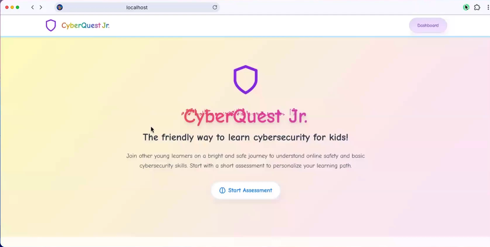

<h1 align="center">🛡️ CyberQuest Jr</h1>

<p align="center">
  <b>An AI-powered cybersecurity education platform for kids aged 8-18!</b>  
  Transform young minds into cyber heroes with personalized, engaging cybersecurity education powered by Google Gemini AI.
</p>

<p align="center">
  
</p>

---

## ✨ Features

- 🤖 **AI-Powered Content Generation** – Google Gemini 2.0 creates personalized cybersecurity lessons  
- 🎯 **Pre-made Quizzes** – Hand-crafted assessments for each learning module  
- 📚 **Dynamic Course Creation** – AI generates comprehensive courses with examples and explanations  
- 🎨 **Kid-Friendly Design** – Colorful, vibrant interface designed specifically for children  
- 🔄 **Automatic User Management** – Zero-setup experience - just visit and start learning!  
- ⚡ **Instant Learning** – No registration, no setup, no barriers to education  
- 🧠 **Smart Content** – AI adapts explanations to be age-appropriate and engaging  

---

## 🎓 Available Courses

1. 🔐 **Password Heroes** – Creating and managing strong passwords  
2. 🕵️ **Phishing Detective** – Identifying and avoiding phishing attacks  
3. 🌍 **Digital Footprints** – Understanding your online presence  
4. 📱 **Social Media Safety** – Safe practices on social platforms  
5. 🛡️ **Cyber Bullying Defense** – Handling online harassment  
6. 🔒 **Privacy Guardian** – Protecting personal information online  

Each course includes:  
- ✅ AI-generated comprehensive explanations  
- ✅ Real-world examples and scenarios  
- ✅ Age-appropriate language and concepts  
- ✅ Interactive pre-made quizzes  
- ✅ Progress tracking and completion certificates  

---

## 🚀 Quick Start

### 📦 Prerequisites
- Python 3.8+  
- Node.js 16+  
- Google Gemini API Key (free from Google AI Studio)  

### ⚙️ Installation

```bash
# Clone the repository
git clone https://github.com/Aarav2709/CyberQuestJR.git
cd CyberQuestJR
```

```bash
# Setup environment variables
cd backend
echo "GEMINI_API_KEY=your_gemini_api_key_here" > .env
```

```bash
# Install backend dependencies
pip install -r requirements.txt
```

```bash
# Install frontend dependencies
cd ../frontend
npm install
```

```bash
# Start backend server
cd ../backend
python app.py
```

```bash
# Start frontend development server
cd ../frontend
npm run dev
```

➡️ Open your browser at `http://localhost:3000` and start learning! 🎉  

---

## 🤖 AI Integration Setup

1. Visit [Google AI Studio](https://ai.google.dev/)  
2. Sign up for a free account  
3. Navigate to **Get API Key**  
4. Create a new API key  
5. Copy the key to your `.env` file in the backend directory  

---

## 🏗️ Architecture

### 🔧 Backend (Flask + SQLAlchemy + Google Gemini AI)
- Flask API Server (port 8000)  
- Google Gemini `2.0-flash-exp` for AI content generation  
- SQLite Database for user progress and course data  
- Automatic CORS handling for frontend integration  

### 🎨 Frontend (React + TypeScript + Vite)
- React 18 with TypeScript  
- Vite for fast builds and hot reload  
- Tailwind CSS for styling  
- Automatic user creation, no manual setup needed  

```
CyberQuestJR/
├── backend/
│   ├── app.py                 # Flask app with AI integration
│   ├── requirements.txt       # Python dependencies
│   └── .env                   # Environment variables
├── frontend/
│   ├── src/
│   │   ├── components/        # Reusable React components
│   │   ├── pages/             # Application pages
│   │   ├── services/          # API integration
│   │   └── types/             # Type definitions
│   ├── package.json           # Node.js dependencies
│   ├── tailwind.config.js     # Styling configuration
│   └── vite.config.ts         # Build configuration
├── deployment/                # Setup scripts
│   ├── linux.sh
│   └── windows.bat
└── README.md
```

---

## 🧩 How It Works

1. Visit the Website – no registration, automatic user creation  
2. Browse colorful dashboard with vibrant course cards  
3. Select a course – pick any cybersecurity topic  
4. AI generates personalized lessons  
5. Learn and practice with examples  
6. Take quizzes and test knowledge  
7. Track progress – automatic saving and completion certificates  

---

## 🔧 Troubleshooting

### 🖥️ Backend
- Missing Gemini API key → ensure `.env` is set  
- Install Python dependencies:  
  ```bash
  pip install flask flask-cors requests google-generativeai python-dotenv sqlalchemy
  ```  
- Ensure Python 3.8+ is installed and port 8000 is free  

### 🌐 Frontend
- Install dependencies:  
  ```bash
  npm install
  ```  
- Port usage: frontend (3000), backend (8000)  
- CORS: backend already configured for localhost  

---

## 🌟 Key Features Explained

### 🧑‍🤝‍🧑 Automatic User Creation
- Zero setup: users created instantly  
- Persistent: data saved in localStorage  
- Resilient: recovers if data is lost  

### 🤖 AI-Powered Lessons
- Google Gemini generates lessons  
- Content tailored for age groups  
- Real-world examples included  

### 🎨 Kid-Friendly Design
- Vibrant colors & visuals  
- Simple navigation  
- Mobile responsive  

---

## 🤝 Contributing

1. Fork the project  
2. Create a branch: `git checkout -b feature/amazing-feature`  
3. Commit changes: `git commit -m 'Add amazing feature'`  
4. Push: `git push origin feature/amazing-feature`  
5. Open a Pull Request  

---

## 📄 License

Licensed under the MIT License. See the [LICENSE](LICENSE) file for details.  

---

## 🌍 Educational Impact

- Teach kids safe password practices  
- Help them recognize phishing scams  
- Manage digital footprints responsibly  
- Promote safe social media use  
- Provide cyberbullying defense skills  
- Build strong privacy awareness  

---

## 🌟 Acknowledgments

- Google Gemini AI  
- React Community  
- Flask Framework  
- Tailwind CSS  
- All contributors ❤️  

---

<p align="center"><b>🚀 Ready to create cyber heroes? Start CyberQuest Jr today!</b></p>
